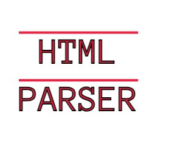
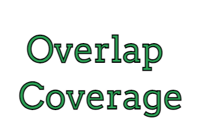

Portfolio
=========

Programming Projects
--------------------

*For access to my private project repositories, please [email me](mailto:jeengelhardt@csustudent.net) with the subject line, GitHub Access.

---
### [Restaurant Menu Generator | CSCI 325](project1.md)

---
### [HTML Parser | CSCI 315](project2.md)

---
### [Overlap Coverage of a Group | CSCI 315](project3.md)

---
### [Run For the Huns | CSCI 334](project4.md)

Ethics Papers
-------------

### <a href= "pdf/Algorithms.pdf" target="_blank">Algorithms</a>

-   **Class: CSCI 332 Applied Networking**
-   **Grade: A-**

### <a href= "pdf/Security Engineering Ethical Concerns.pdf" target="_blank">Security Engineering Ethical Concerns</a>

-   **Class: CSCI 432 Network Penetration and Ethical Hacking** 
-   **Grade: A**

### <a href= "pdf/Have We Done Enough.pdf" target="_blank">Have We Done Enough</a>

-   **Class: CSCI 315 Data Structures** 
-   **Grade: A**

---

Presentations
-------------

### <a href= "pdf/Rootkits.pdf" target="_blank">Rootkits</a>

- **Class: CSCI 330 Computer Architecture**
- **Grade: A**

### <a href= "pdf/ComputerForensics.pdf" target="_blank">Computer Forensics</a>

- **Class: CSCI 405 Principles of Cybersercurity**
- **Grade: A**

---

Page template forked from <a href="https://github.com/csu-cs/csci-portfolio">CSU-CS</a>

<!-- Remove above link if you don't want to attributive -->
