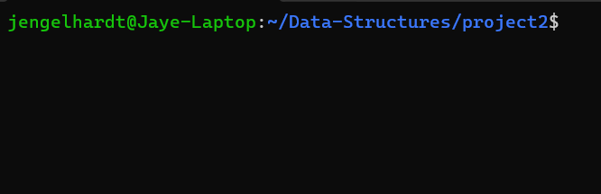
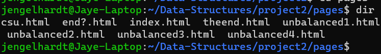
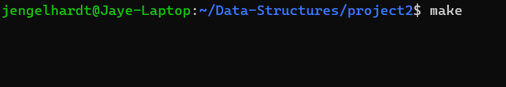
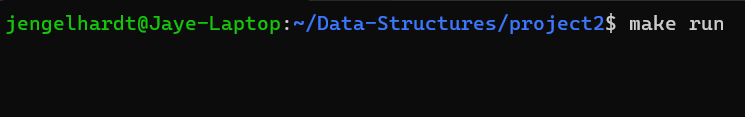
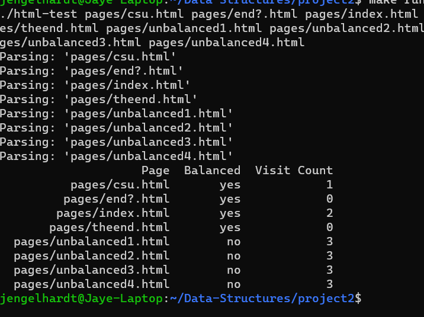

[Back to Portfolio](./)

HTML PARSER
===============

-   **Class: CSCI 315 Data Structures**
-   **Grade: A**
-   **Language(s): C++** 
-   **Source Code Repository:** [packerfan81/HTML_PARSER](https://github.com/Packerfan81/Data-Structures/tree/master/project2)  
    (Please [email me](mailto:jeengelhardt@csustudent.net?subject=GitHub%20Access) to request access.)

## Project description

 This is a simple CLI program.  First it runs HTML webpages through a parser to determine if they are balanced.  After that the program determines how many individual webpages you can visit from each web page.  Then outputs that data to the command line.


## How to compile and run the program

How to compile (if applicable) and run the project.

```bash
cd /project location
make run
```

## UI Design


  
Fig 1. Launch Screen.
---

  
Fig 2. Sample webpages to be processed.


  
Fig 3. How to complile the program.


  
Fig 4. How to run the program.


  
Fig 5. Output of Program.

## 3. Additional Considerations

You can add more HTML files to test as long as they are in the same source directory.

For more details see [GitHub Flavored Markdown](https://guides.github.com/features/mastering-markdown/).

[Back to Portfolio](./)
