[Back to Portfolio](./)

Overlap Coverage
===============

-   **Class: CSCI 315 Data Structures**
-   **Grade: A**
-   **Language(s): C++**
-   **Source Code Repository:** [packerfan81/Overlap_Coverage](https://github.com/Packerfan81/Data-Structures/tree/master/project3))  
    (Please [email me](mailto:jeengelhardt@csustudent.net?subject=GitHub%20Access) to request access.)

## Project description

The program takes the data given as sets. A set will not have duplicate numbers. Then covers will be provided to be tested against.  A group of sets will then be queried against the covers provided.  After all sets have been tested output will given in the minimum number of overlaps to find a cover for each cover.  The time it took to find each cover and the mean time of all covers found, and if a cover could not be found.

## How to compile and run the program

How to compile (if applicable) and run the project.

```bash
cd ./project location
make run
make small30
make med30
make large30
make large50
make small100
make small-timings
make medium-timings
make large-timings

```
- Each command will run different data sets and output the time it takes to calculate the minimum overlap.
- The make small-timings command will graph the data from small30 dataset.
- The make medium-timings command will graph the data from med30 dataset.   
- The make large-timings command will graph the data from large50 dataset.   
    

## UI Design

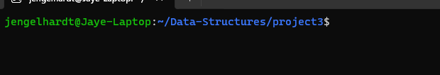  
Fig 1. Launch Screen.
<br> <br />
<br> <br />
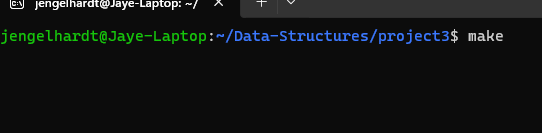  
Fig 2. Building The Program.
<br> <br />
<br> <br />
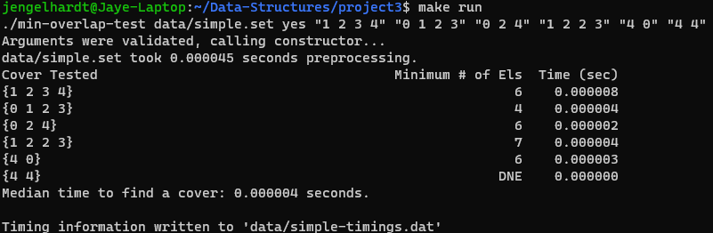  
Fig 3. Simple Run.
<br> <br />
<br> <br />
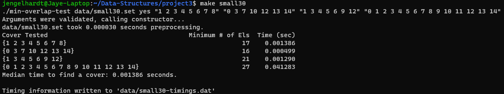  
Fig 4 Small30 Data Set.
<br> <br />
<br> <br />
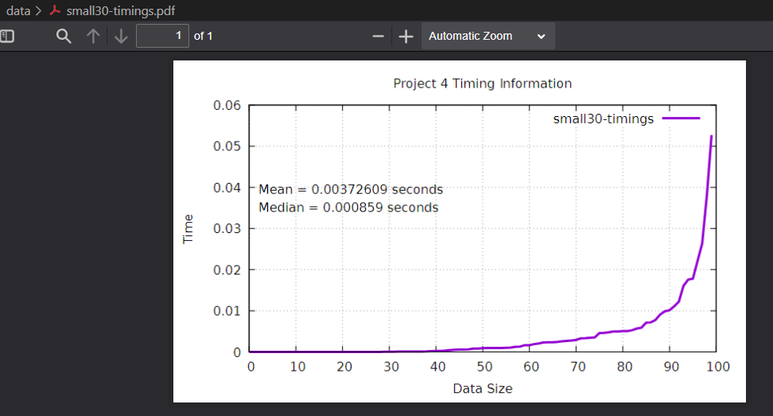  
Fig 5 Small30 Data Set Graph.
<br> <br />
<br> <br />
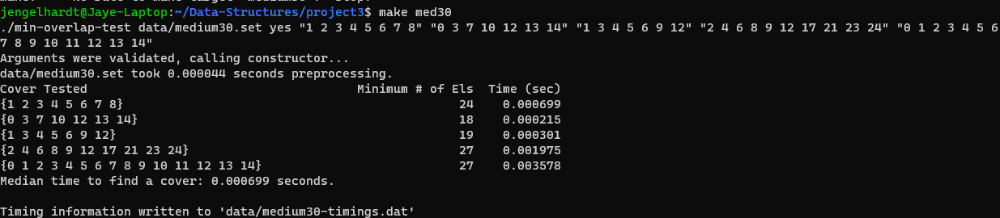  
Fig 6 Medium30 Data Set.
<br> <br />
<br> <br />
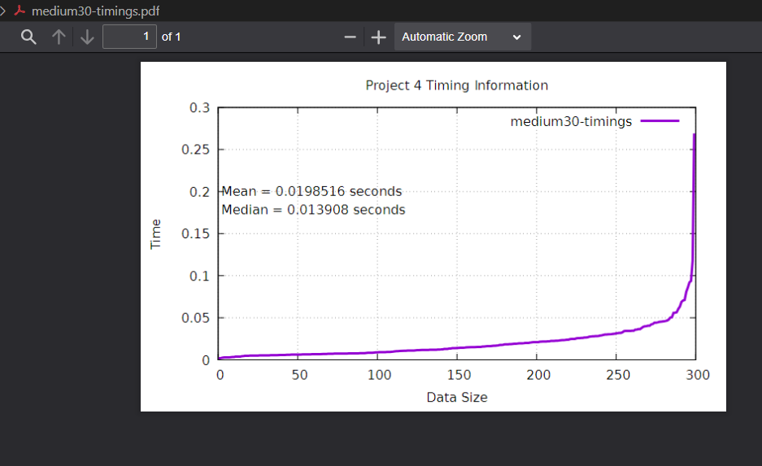  
Fig 7 Medium30 Data Set.
<br> <br />
<br> <br />
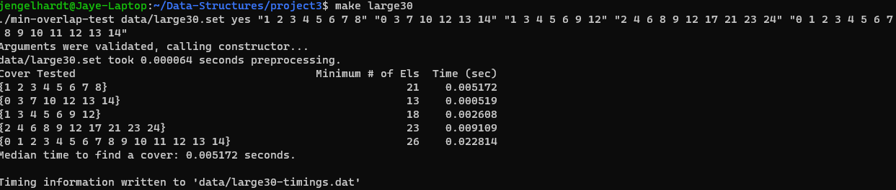  
Fig 8 Large30 Data Set.
<br> <br />
<br> <br />
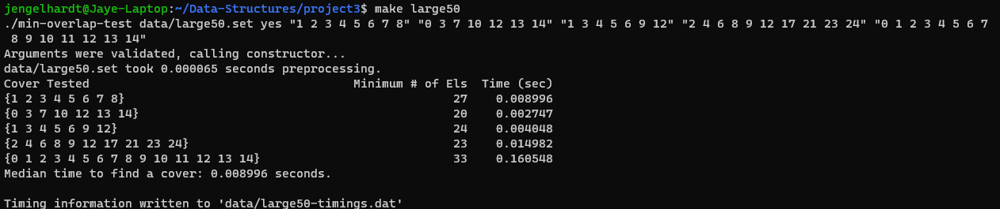  
Fig 9 Large50 Data Set.
<br> <br />
<br> <br />
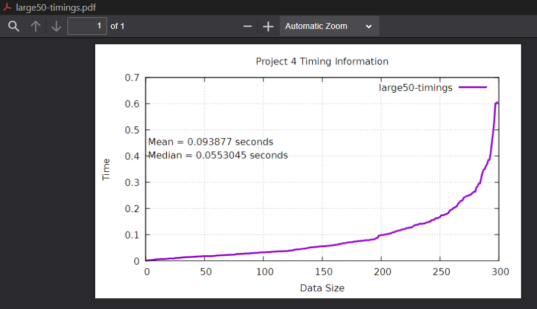  
Fig 10 Large50 Data Set Graph.
<br> <br />
<br> <br />
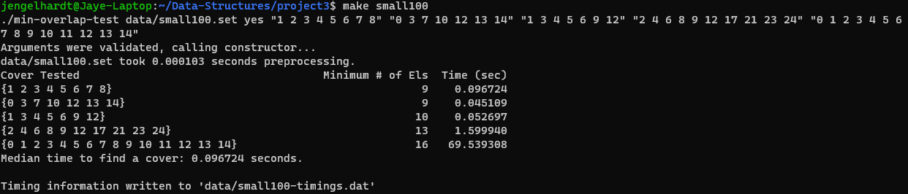  
Fig 11 Small100 Data Set.
<br> <br />
<br> <br />

## 3. Additional Considerations

You can have all the data sets make graphs with changes to the makefile.

<br> <br />
<br> <br />
For more details see [GitHub Flavored Markdown](https://guides.github.com/features/mastering-markdown/).

[Back to Portfolio](./)
