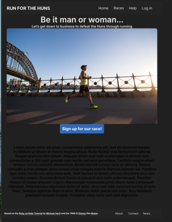
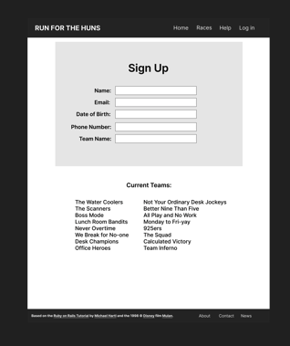
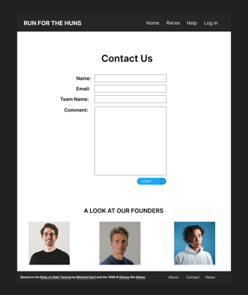
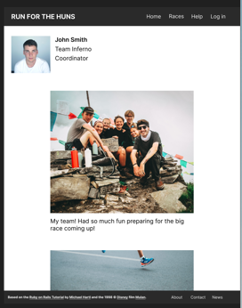
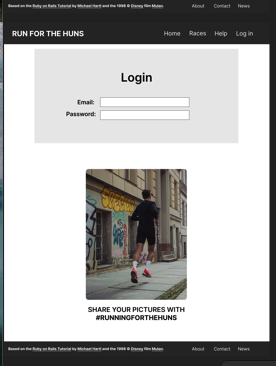
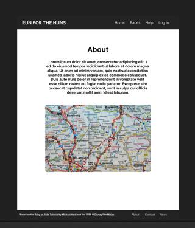
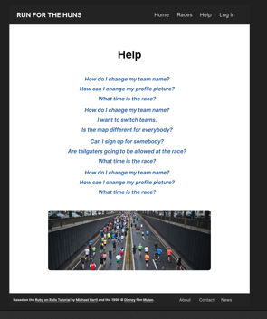
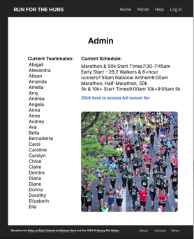

[Back to Portfolio](./)

Run For The Huns
===============

-   **Group:** Matt Weigel, Myles O'Toole, and Micah Stargel 
-   **Class: CSCI 334 User Interface**
-   **Grade: A** 
-   **Language(s): Ruby, HTML, CSS, JavaScript, SCSS
-   **Source Code Repository:** [features/mastering-markdown](https://guides.github.com/features/mastering-markdown/)  
    (Please [email me](mailto:jeengelhardt@csustudent.net?subject=GitHub%20Access) to request access.)

## Project description

A website to support that informs the public of a 5K race that a charity is putting on to raise money.  The website is support on different platforms including desktops, tablets and mobile phones.  The public part of the website display information about the charity, and information about the race.  The private part of the website is for registered 5k runners.  You can sign up as a team or as an individual, you can also change later.  Once you are a registered user you will be able to see the race day schedule, teammates and a map of the route of the race.


## How to compile and run the program

How to compile (if applicable) and run the project.

**First Installation**

1. To get started with the app, clone the repo, install the needed gem and migrate the database:

```
gem install bundler -v 2.3.14
```

```
bundle _2.3.14_ config set --local without 'production'
```

```
bundle _2.3.14_ install
```

```
rails db:migrate
```

## Testing and Deployment

1. To test suite to verify that everything is working correctly:

```
rails test
```

2. When the test suite passes, you'll be ready to run the app in a local server:

```
rails server
```

## UI Design

Fig 1. The Home screen.
 <br />

Fig 2. The Sign Up Page.
 <br />

Fig 3. Contact Page.
 <br />

Fig 4. Team Page.
 <br />

Fig 5. The Login Screen.
 <br />

Fig 6. About Screen.
 <br />

Fig 7. Help Page.
 <br />

Fig 8. Admin Page.
 <br />


<br><br />


For more details see [GitHub Flavored Markdown](https://guides.github.com/features/mastering-markdown/).

[Back to Portfolio](./)
